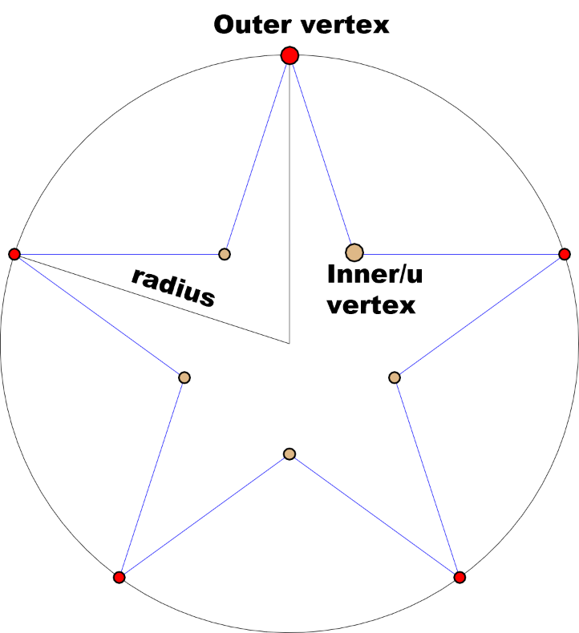
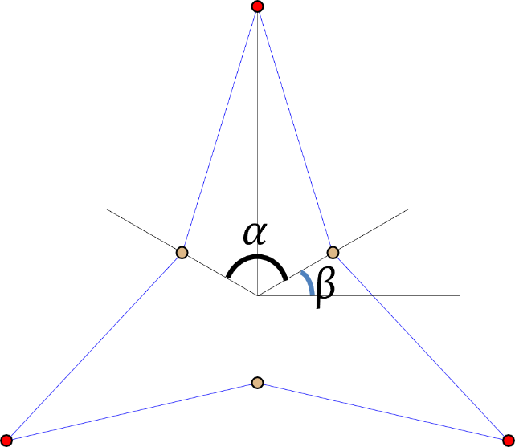
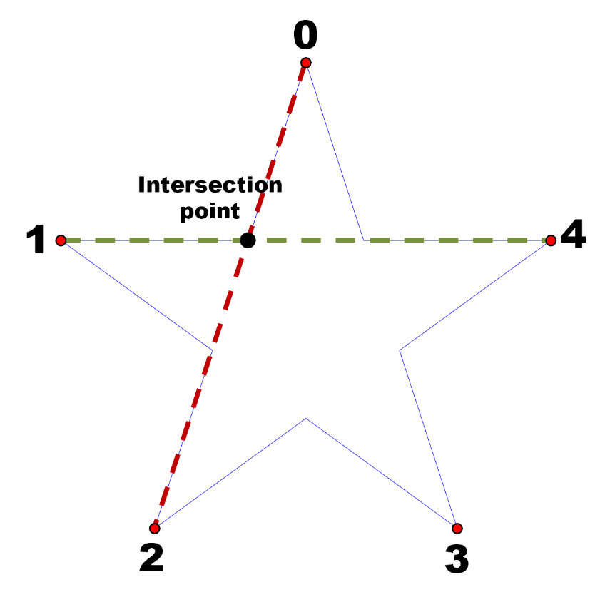
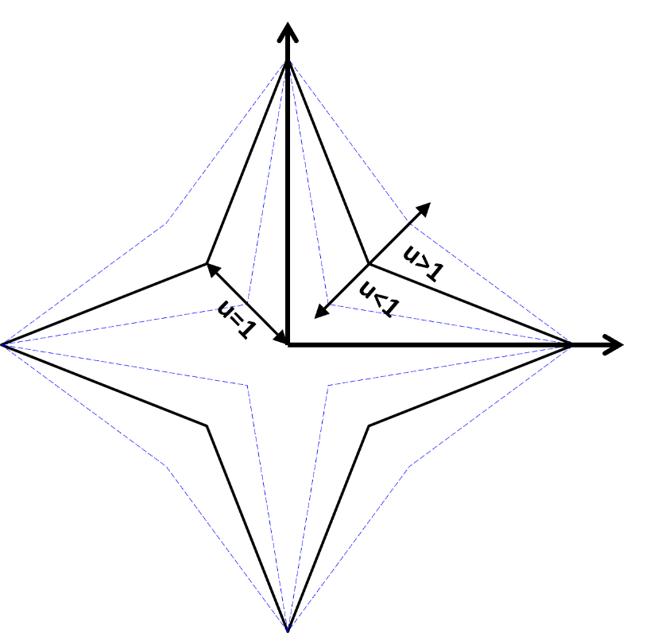
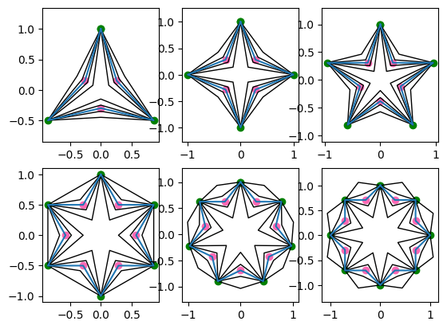

# StarPolygon: How To Draw Star Polygons?
# Date: 12/23/2023

1. Definition of Star Polygons **
    - Star polygons are inscribed in a circle of given radius.
    - Star polygons have outer vertices and inner vertices.
    - To find the inner vertices of a star polygon, we need to calculate the intersection points of the lines formed by the outer vertices. However, the calculation is different for the case where there are 3 or 4 outer vertices.

2. Star Polygon Diagram**


2. Calculate outer vertices**
    - n : the number of outer vertices


3. Calculate Inner Vertices**

Case 1: n=3 or 4


Case 2: n > 4
Find the intersection point of two lines of given four outer vertices. The slopes of two lines are normal.


When x1=x2 or x3=x4


4. Intersection Point Line Index Sequence**
<table style="width:100%;">
<colgroup>
<col style="width: 20%" />
<col style="width: 11%" />
<col style="width: 11%" />
<col style="width: 11%" />
<col style="width: 11%" />
<col style="width: 11%" />
<col style="width: 22%" />
</colgroup>
<thead>
<tr class="header">
<th>i</th>
<th>0</th>
<th>1</th>
<th>2</th>
<th>3</th>
<th>4</th>
<th></th>
</tr>
</thead>
<tbody>
<tr class="odd">
<td rowspan="2">First Line Vertex Index</td>
<td>0</td>
<td>1</td>
<td>2</td>
<td>3</td>
<td>4</td>
<td><strong>i</strong></td>
</tr>
<tr class="even">
<td>2</td>
<td>3</td>
<td>4</td>
<td>0</td>
<td>1</td>
<td><strong>(i+2)%n</strong></td>
</tr>
<tr class="odd">
<td rowspan="2">Second Line Vertex Index</td>
<td>1</td>
<td>2</td>
<td>3</td>
<td>4</td>
<td>0</td>
<td><strong>(i+1)%n</strong></td>
</tr>
<tr class="even">
<td>4</td>
<td>0</td>
<td>1</td>
<td>2</td>
<td>3</td>
<td><strong>(n-1+i)%n</strong></td>
</tr>
</tbody>
</table>

5. Star Polygon (n= 3, 4, 5, 6, 7, 8 )**


6. Move Inner Vertices**


7. Result


8. Python Code
```python
import numpy as np
import matplotlib.pyplot as plt

def star_polygon(xc, yc, nvert, radius):
    vs = np.zeros(nvert*2*2+2)

    for k in range(nvert):
        angle = 0.5*(4*k+nvert)*np.pi/nvert
        vs[k*4] = xc+radius*np.cos(angle) 
        vs[k*4+1] = yc+radius*np.sin(angle) 
    vs[-1] = vs[1]
    vs[-2] = vs[0]

    xx = vs[0::4]
    yy = vs[1::4]

    if nvert == 3 or nvert == 4:
        default_u = nvert*0.1
        for i in range(nvert):
            angle = 2*np.pi*(i+1)/nvert+0.5*(nvert-2)*np.pi/nvert
            px = xc+default_u*radius*np.cos(angle)
            py = yc+default_u*radius*np.sin(angle)
            vs[2+i*4] = px
            vs[2+i*4+1] = py
    else:
        for i in range(nvert):
            i1 = i
            i2 = (i+2)%nvert
            i3 = (i+1)%nvert
            i4 = (nvert-1+i)%nvert

            x1, y1 = xx[i1], yy[i1]
            x2, y2 = xx[i2], yy[i2]
            x3, y3 = xx[i3], yy[i3]
            x4, y4 = xx[i4], yy[i4]

            if abs(x2-x1) < 1e-10:
                m = (y4-y3)/(x4-x3)
                px= x1
                py= m*(px-x3)+y3

            elif abs(x3-x4) < 1e-10:
                m = (y2-y1)/(x2-x1)
                px= x3
                py= m*(px-x1)+y1
            else:
                m1 = (y2-y1)/(x2-x1)
                m2 = (y4-y3)/(x4-x3)
                px = (m1*x1-y1-m2*x3+y3)/(m1-m2)
                py = m1*(px-x1)+y1

            vs[2+i*4] = px
            vs[2+i*4+1] = py
    return vs

def plot_star_polygon(subnum, vss):
    ax = plt.subplot(subnum)
    ax.plot(vss[0::2], vss[1::2])
    ax.scatter(vss[2::4], vss[3::4], color='hotpink')
    ax.scatter(vss[::4], vss[1::4], color='green')
    ax.axis('equal')

class StarPolygon:
    def __init__(self,
                 sx, 
                 sy, 
                 nvert=5,
                 radius  = 1,
        ) -> None:
        if nvert < 3:
            raise ValueError('nvert must be greater than equal 3')
        self.nvert = nvert
        self.sx = sx
        self.sy = sy
        self.vertex = star_polygon(sx, sy, nvert, radius)
        self._u_vertex = np.zeros(nvert*2)
        self._u_vertex[::2] = self.vertex[2::4]
        self._u_vertex[1::2] = self.vertex[3::4]

    def reset_uvertex(self):
        self.vertex[2::4] = self._u_vertex[0::2]
        self.vertex[3::4] = self._u_vertex[1::2]

    @property
    def xss(self):
        return self.vertex[0::2]
        
    @property
    def yss(self):
        return self.vertex[1::2]

    @property
    def pxs(self):
        return self.vertex[0::4]

    @property
    def pys(self):
        return self.vertex[1::4]
        
    @property
    def uxs(self):
        return self.vertex[3::4]

    @property
    def uys(self):
        return self.vertex[4::4]
        
    @property
    def u_radius(self):
        return np.sqrt(self.vertex[2]**2+self.vertex[3]**2)
        
    @property
    def u_param(self):
        return self._param_u
        
    # u -> 1 : inner radius
    # u < 1, u =1, u > 1
    @u_param.setter
    def u_param(self, u):
        for i in range(self.nvert):
            self.vertex[2+i*4] = self.sx+(self._u_vertex[i*2]-self.sx)*u
            self.vertex[2+i*4+1] = self.sy+(self._u_vertex[i*2+1]-self.sy)*u

def move_uvertex(subnum, star):
    uu = np.linspace(0.5, 1.5, 4)
    for u in uu:
        star.u_param = u
        plt.subplot(subnum)
        plt.plot(star.xss, star.yss, color="k", linewidth=1)

def plot_all():
    stars = [StarPolygon(0,0,n) for n in range(3,9)]
    nrow, ncol = 2, 3
    
    for i, st in enumerate(stars):
        subnum = nrow*100+ncol*10+(i+1)
        move_uvertex(subnum, st)
        st.reset_uvertex()
        plot_star_polygon(subnum, st.vertex)
        
    plt.show()

plot_all()
```

aa
